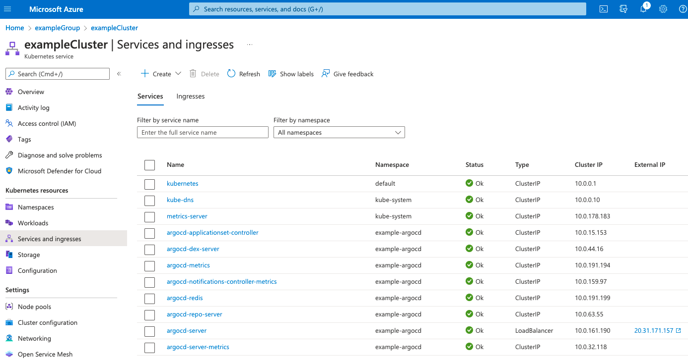
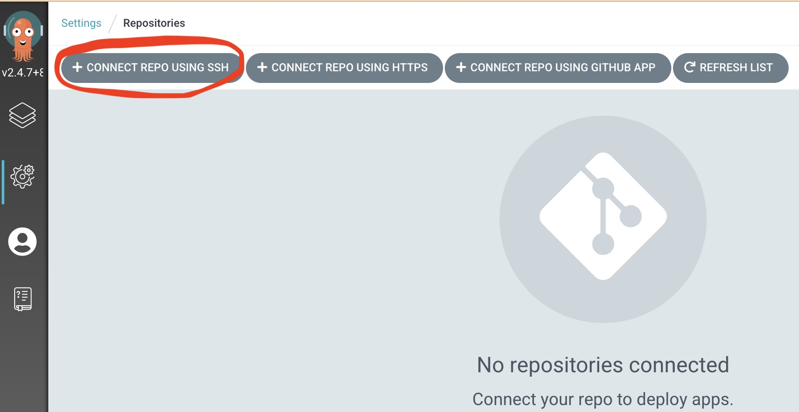
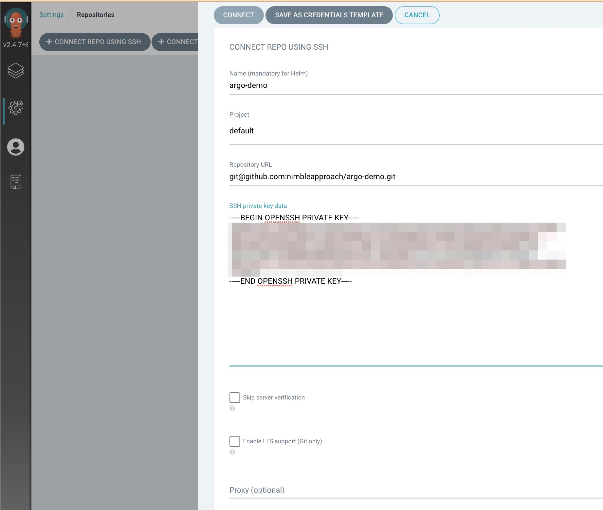
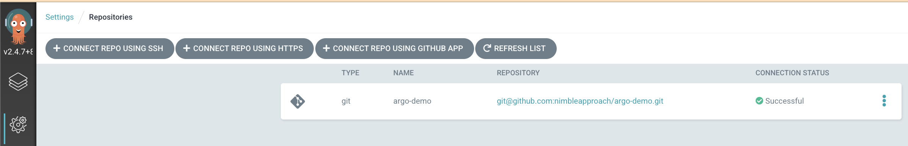

# argo-demo
A demo use of [Argo CD](https://argo-cd.readthedocs.io/en/stable/) ([docs](https://argo-cd.readthedocs.io/en/stable/)). 

This readme should provide the instructions necessary to set up a basic Kubernetes cluster which contains Argo, then use Argo to manage the deployment of an image into the cluster via command line (for possible future scripting)

This project (eventually) should be cloud-agnostic (currently targets Azure).

For a short version, check out:
 * [installAKS.sh for creating an AKS cluster on Azure](./installAKS.sh)
 * [newKeyPair.sh for generating a new key pair](./newKeyPair.sh) to set up argo repo

## Pre-requisites
- A GitHub account (other repositories are available)
- [Homebrew](https://brew.sh) is installed (assumes mac)

---
Note:
This guide assumes the use of MacOS with permissions to be able to install various apps
---

### 1) Set up a Kubernetes Cluster
See [here](./docs/installK8s.md)

From here, we assume `kubectl` is installed/authenticated.

### 2) Deploy Argo to Kubernetes

These steps assume the following environment variables:
```
export APP_NAME=example
export ARGO_NAMESPACE="argocd"
```

---
Note:
If you don't want to keep specifying the namespace (`-n`), you can set the default namespace like this:
```
kubectl config set-context --current --namespace=$ARGO_NAMESPACE
```

Also, for the 'ARGO_NAMESPACE', from the argo docs:
The installation manifests include ClusterRoleBinding resources that reference argocd namespace. 
If you are installing Argo CD into a different namespace then make sure to update the namespace reference._
---

Install argocd locally and on the kubernetes cluster:
```
brew install argocd
kubectl create namespace $ARGO_NAMESPACE
kubectl apply -n $ARGO_NAMESPACE -f https://raw.githubusercontent.com/argoproj/argo-cd/stable/manifests/install.yaml
kubectl patch svc argocd-server -n $ARGO_NAMESPACE -p '{"spec": {"type": "LoadBalancer"}}'
```

The last step exposes the Argo API with a public IP so we can use the Argo CLI or UI. 

You can find the IP in:
 * Azure: in the Azure portal under 
 * AWS: *TODO*
 * GCP: *TODO*


Alternatively, instead of patching the LoadBalancer, you can set up argo using [this ingress controller](./ingress/README.md)

### 3) Retrieve the ArgoCD initial password

```
ARGO_PWD=`kubectl -n $ARGO_NAMESPACE get secret argocd-initial-admin-secret -o jsonpath="{.data.password}" | base64 -d; echo`
echo $ARGO_PWD
```

### 4) Login on the command line
Use `argocd login [IP]`. Eventually likely to have some internally accessible host name.

The default username is *admin*

Alternative login at https://[IP] for the UI

It is likely we may want to deploy Argo to a separate cluster or location to the cluster it is managing,
imagine screwing your ingress rules torpedoing your access to everything, and having to fix things manually (I managed it!).
If this is how we proceed then pay attention to Optional step 5 in the Argo guide.

### 5) Connect Argo with your github repository
Next we'll connect Argo with our GitHub repository.

(We'll use the Argo UI, though could equally use the argo command-line)

To do this, we'll create a new key pair, adding the public key to github and the private key to argo CD.

See [github instructions](https://docs.github.com/en/authentication/connecting-to-github-with-ssh/adding-a-new-ssh-key-to-your-github-account), which is basically:
- run `ssh-keygen -t ed25519 -C your@email.com`
- copy the public key (e.g. `pbcopy < id_rsa_ed25519.pub`) and add that to your github account

Now capture the *private* key for Argo:
```
pbcopy < id_rsa_ed25519
```

With this *private* key in hand, use the Argo UI, go to *Settings* (the cog item on the left), select *Repositories*, then select *CONNECT REPO USING SSH* (button top left) and follow the instructions:


You will need to copy the *private* key from the id_rsa file we created earlier and specify the "*.git" ssh URL for our repository:


Which should successfully connect:


We're now ready to add some applications!!

### 6) Create a new kubernetes application from the repo

We'll now create a new kubernetes application from our repository (which, for this tutorial, is THIS repository).

Note:
If we wanted to, we could use our own image from our own container registry, as if created from our CI pipeline. See faking continuous integration [here](./docs/fakingContinousIntegration.md)

Our kubernetes application is in our [helloworld](helloworld) directory for this application, so we'll use that *path*.

We'll use the ArgoCD command line (log in using `argocd login [ID]` with 'admin' user and our $ARGO_PWD password)

The command for creating a new application called "helloworld" (the application name must be lowercase) which watches the 'helloworld' path is:
```
argocd app create helloworld \
  --repo git@github.com:nimbleapproach/argo-demo.git \
  --path helloworld \
  --dest-server https://kubernetes.default.svc \
  --dest-namespace default \
  --sync-policy auto
```

We can check the state of our app within the UI or with `argocd app get helloworld`

There should also be a new workload in our AKS cluster in Portal named *helloworld*

If you used the image as above hopefully it is showing as LoadBalancer with a public IP (for testing purposes) with *Services and Ingresses* in Portal, clicking on it should open the helloworld page. 
If there isn't a load balancer we can patch it as we did for the argo server

We can now do things like change the number of replicas in the deployment yaml and see the app is out of sync if we do `argocd app get helloworld` or in the UI, if we are syncing manually you can then do `argocd app sync helloworld` or use the button in the UI, you would hopefully then see this change reflected in Portal.

Note this is one of many, many ways to deploy via Argo (helm charts etc.) that aren't explored here!

### 7) Add github webhook for Argo
Argo will check the repository it is attached to every 3 minutes. If we want it to sync in a more timely manner, then we will need to configure a webhook on the repository feeding Argo. 
The instructions to do so are [here](https://argo-cd.readthedocs.io/en/stable/operator-manual/webhook/) 

### 8) With argo in place, we can install drone

See [here](./docs/installDrone.md) to set up the OAuth app in github.

Then run [installDrone.sh](installDrone.sh) with the github oauth client ID and secret.

### 9) Connect our example app

Let's recall the name from our container registry from earlier.

e.g., on Azure, our [initVars.sh variables](initVars.sh) would be defined as:
```
export MY_CLUSTER_NAME=... 
export MY_GROUP_NAME=...
export MY_REGISTRY_NAME=...
az aks check-acr -n "$MY_CLUSTER_NAME" -g "$MY_GROUP_NAME" --acr "$MY_REGISTRY_NAME"
```


To get the ACR we would run:
```
MY_ACR_SCOPE=$(az acr show --name s"${MY_REGISTRY_NAME:?}" --query "id" --output tsv)
```

Create a service principle for the container registry
```
[[ -z "${MY_APP_PRINCIPAL}" ]] && export MY_APP_PRINCIPAL="${MY_APP_NAME}Principle"

export MY_ACRPUSH_PWD=$(az ad sp create-for-rbac --name "${MY_APP_PRINCIPAL:?}" --scopes "${MY_ACR_SCOPE:?}" --role acrpush --query "password" --output tsv)
export MY_ACRPUSH_USR=$(az ad sp list --display-name "${MY_APP_PRINCIPAL:?}" --query "[].appId" --output tsv)
```

## Links
- [AKS Quickstart](https://docs.microsoft.com/en-us/azure/aks/learn/quick-kubernetes-deploy-cli)
- [ACR Quickstart](https://docs.microsoft.com/en-us/azure/container-registry/container-registry-get-started-azure-cli)
- [Argo Getting Started](https://argo-cd.readthedocs.io/en/stable/getting_started/)
