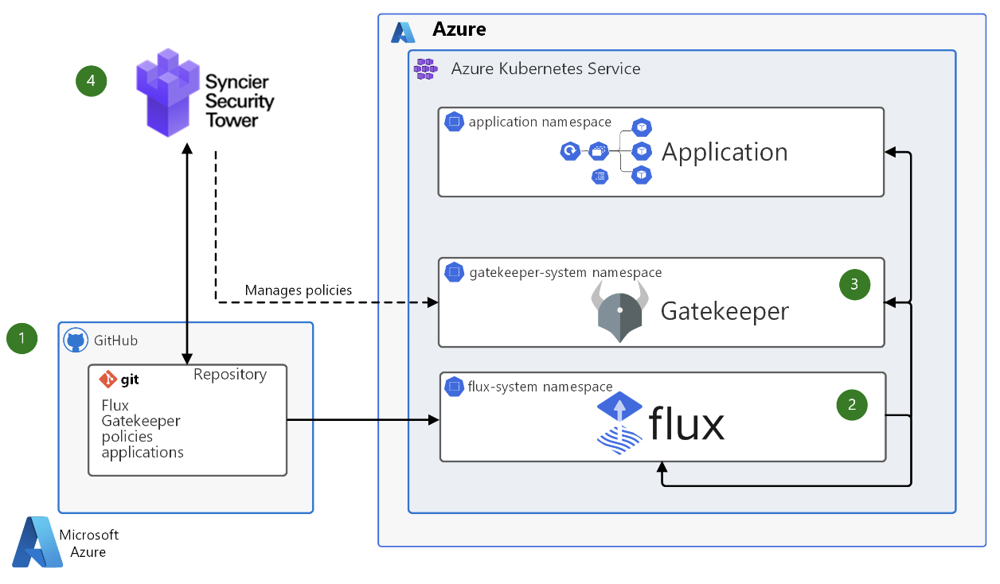
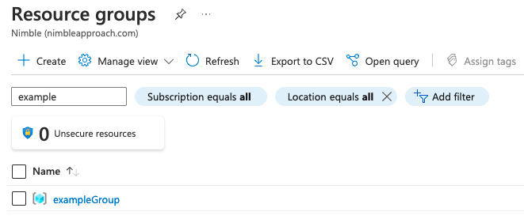

[back](../README.md)

# Set up Azure AKS

These instructions assume you've created an [Azure account](https://portal.azure.com/)

This is the "click-ops" option. In a production environment, this would be created via an 'infrastructure-as-code' pipeline.

These instructions will result in this AKS blueprint architecture:
 

As documented by microsoft [here](https://docs.microsoft.com/en-us/azure/architecture/example-scenario/gitops-aks/gitops-blueprint-aks), 
but using Argo instead of Flux.


## Steps

These steps assume the following env variables:

```
export APP_NAME=example
export GROUP_NAME="${APP_NAME}Group"
export CLUSTER_NAME="${APP_NAME}Cluster"
export REGISTRY_NAME="${APP_NAME}containerregistry"
export NODE_COUNT=1
export LOCATION=uksouth
```
### Install the Azure Command Line Interface (CLI)
Required for interfacing with azure, run the following command:
- `brew install azure-cli`

### Login to Azure CLI
This will allow you to run commands against your Azure account/subscription:
```
az login
```

---
**Note**
If you have the one subscription you'll log into it automatically, otherwise we may have to switch with the az account command
---

Register the 2 providers below:
```
az provider register --namespace Microsoft.OperationsManagement
az provider register --namespace Microsoft.OperationalInsights
```

### Create resource group
Our services will be grouped here:
```
az group create --name $GROUP_NAME --location $LOCATION
```

Which should response with:
```
{
  "id": "/subscriptions/<subscription id>/resourceGroups/exampleGroup",
  "location": "uksouth",
  "managedBy": null,
  "name": "exampleGroup",
  "properties": {
    "provisioningState": "Succeeded"
  },
  "tags": null,
  "type": "Microsoft.Resources/resourceGroups"
}
```
- It should also appear in [the Azure portal](https://portal.azure.com) after a few seconds:
- 

### Create AKS cluster
Now create our kubernetes cluster in our new resource group:
```
az aks create -g $GROUP_NAME -n $CLUSTER_NAME --enable-managed-identity --node-count $NODE_COUNT --enable-addons monitoring
```
Where:
- -g refers to the resource group we created previously
- -n specifies the name we are giving to the cluster, feel free to change
  (see az aks docs [here](https://docs.microsoft.com/en-us/cli/azure/aks?view=azure-cli-latest))
 
---
**Note**
this command may take several minutes to run, again look for **"provisioningState": "Succeeded"** when the response comes back
---

### Create a container registry
We'll use Azure Container Registry (ACR) to store our images within Azure, we'll use the Basic [service tier](https://docs.microsoft.com/en-us/azure/container-registry/container-registry-skus) as per [here](https://docs.microsoft.com/en-us/azure/container-registry/container-registry-get-started-azure-cli):

---
**Note:** 
the name you use for the registry must be lowercase and unique across Azure
---

```
az acr create -g $GROUP_NAME -n $REGISTRY_NAME --sku Basic
```


### Install kubectl
This is needed to interface with the AKS cluster, you can do this with:

```
sudo az aks install-cli
az aks get-credentials -g $GROUP_NAME -n $CLUSTER_NAME
```

Where `get-credentials` should create or update your `~/.kube/config` file

---
Potential Problem: 
When `install-cli` is run it will run a Python script against the python version that was installed as a dependency for the Azure CLI in the brew install.
This can result in a certificate issue. 
To resolve you can try running `installcerts.sh` script included in this repository.
---

Optionally can test deploying to AKS as per the quickstart guide, but as we're going to get Argo to deploy there may not be particularly worthwhile

### Attach ACR to AKS
Finally, we need AKS to be able to access the images stored in ACR:
```
az aks update -n $CLUSTER_NAME -g $GROUP_NAME --attach-acr $REGISTRY_NAME
```

---
Note:
you may have to wait `over 30 mins` for this command to report that pull succeeded. If it passed “Validating managed identity existance” [sic] and the AcrPull permission appears to be assigned to the cluster in portal then you're probably going to be fine.
---


If you wanted to check/confirm the cluster can pull from ACR you could run:
```
az aks check-acr -n $CLUSTER_NAME -g $GROUP_NAME --acr $REGISTRY_NAME
```

Whose output should look like this:
```
WARNING: version difference between client (1.24) and server (1.22) exceeds the supported minor version skew of +/-1
[2022-07-26T17:26:21Z] Validating managed identity existance: SUCCEEDED
[2022-07-26T17:26:22Z] Validating image pull permission: SUCCEEDED
[2022-07-26T17:26:22Z] 
Your cluster can pull images from <container registry name>.azurecr.io!
```

[back](../README.md)