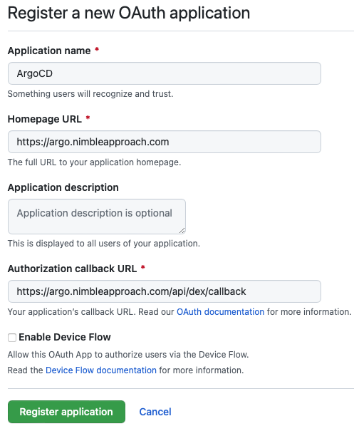
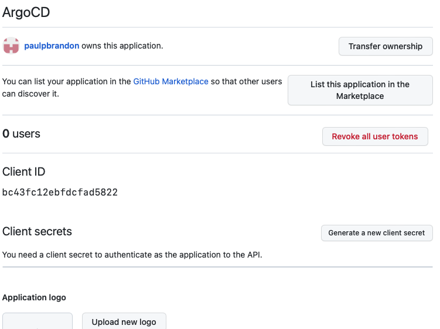
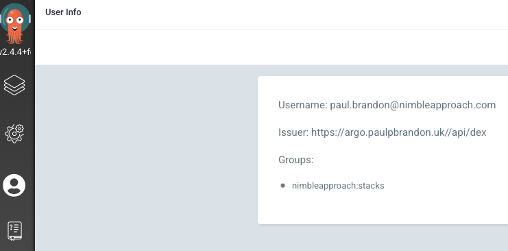
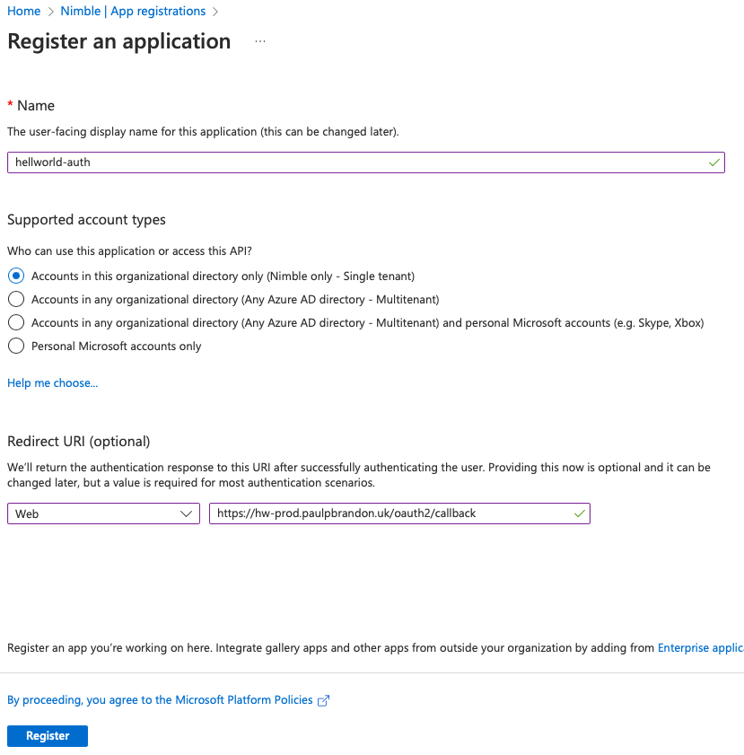
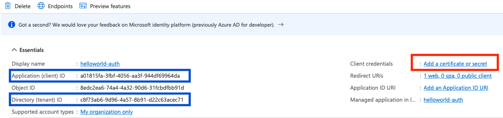
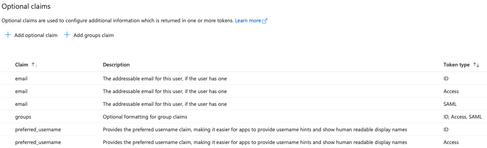
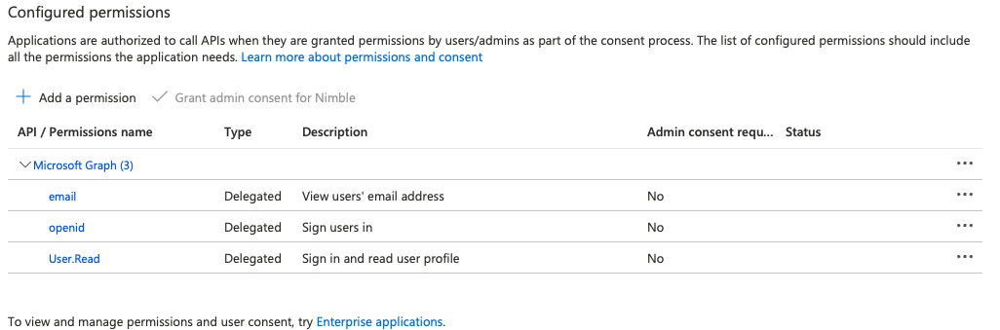
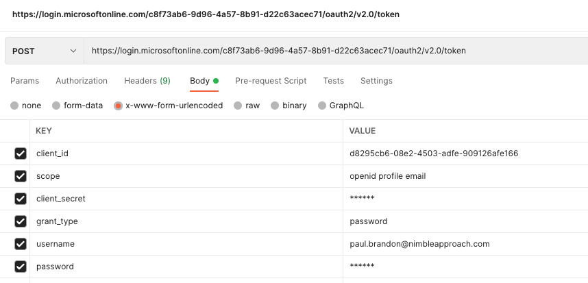
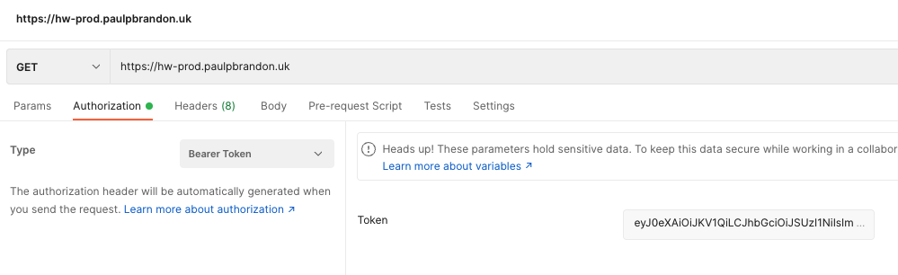

# Single Sign On
Argo has an inbuilt ability to use Single Sign On (SSO) and be integrated with various providers. This means you don't have to create any new users in Argo itself and users' access is defined via their membership of various groups defined by the provider.

We can also give our apps the ability to use SSO without that ability being part of the application itself, we can configure the Ingress for that application to route via an OAuth2 proxy and link into Azure AD.

## Argo + GitHub
Here we will use GitHub as our SSO provider for Argo. As Argo is part of our deployment pipeline it makes sense to link to GitHub accounts rather than say Azure or Google. Permissions will be governed by what team(s) your GitHub user belongs to within an Organization. This is best set up on the organization account, but you can try it on a user account as long as you can get someone to allow it access to your Organization.

### 1) Create GitHub OAuth Application
- In GitHub go to your account settings (from menu top right)
- Select *Developer Settings* from the bottom of the menu on the left.
- Select *OAuth Apps* on the right and hit the *New OAuth App* button
- Fill out the form as follows, replace the host name as necessary:

  
- You will then see something like this when you register the app:

  
- Take note of the client id
- Click the *Generate a new client secret* button, and note down the value you get back (you won't be able to get it later)

### 2) Update Argo ConfigMaps
In order to enable SSO in Argo we need to update some config, namespace *argocd* is assumed, and kubectl is configured to connect to the relevant AKS cluster
Also you can use *kubectl edit* here but it didn't seem to play nice with my default editor, so this guide will pull the config down and apply it back
- `kubectl get ConfigMap argocd-cm -n argocd -o yaml > argocd-cm.yaml` to download to a file named *argocd-cm.yaml*
- Edit this file in an editor of your choice to include the following:
```yaml
data:
  dex.config: |
    connectors:
      - type: github
        id: github
        name: GitHub
        config:
          clientID: {your_github_client_id}
          clientSecret: {your_github_client_secret}
          orgs:
          - name: nimbleapproach
  url: https://argo.nimbleapproach.com/
```
- By defining *orgs* this will restrict access to users who are part of this organization, as long as the OAuth app defined in the step above has access to the same org
- It may also be possible to put the secret in argocd-secrets and reference that (one to update later)
- `kubectl apply -f argocd-cm.yaml -n argocd` to apply the changes.
- We will then also want to create a policy on who can access what.
- `kubectl get ConfigMap argocd-rbac-cm -n argocd -o yaml > argocd-rbac-cm.yaml`
- Edit to include the following:
```yaml
data:
  policy.csv: |
    p, role:org-admin, applications, *, */*, allow
    p, role:org-admin, clusters, get, *, allow
    p, role:org-admin, repositories, get, *, allow
    p, role:org-admin, repositories, create, *, allow
    p, role:org-admin, repositories, update, *, allow
    p, role:org-admin, repositories, delete, *, allow
    g, "nimbleapproach:stacks", role:org-admin
  policy.default: role:readonly
```
- Here we assign admin rights to members of the *stacks* GitHub team in the organization *nimbleapproach*, note we could've used the built-in role, role:admin, but this shows what a policy may look like
- Everybody else gets readonly access
- For more information on setting up policies see: https://argo-cd.readthedocs.io/en/stable/operator-manual/rbac/
- `kubectl apply -f argocd-rbac-cm.yaml -n argocd` to apply the changes.
- Theoretically, everything should update itself, however I did get some strange behaviour, including it still using SSO providers I had removed, so it may be advisable to restart a couple of services
- `kubectl scale deployment argocd-server --replicas=0 -n argocd`
- `kubectl scale deployment argocd-dex-server --replicas=0 -n argocd`
- `kubectl get deployments -n argocd` to check they are down
- Then run the same scale commands with replicas=1 to bring them back up

### Log in to Argo
When you go to the Argo homepage, you should now have a *Login via GitHub* button, clicking on this will take you to the GitHub login.
- On the first login it will likely ask you authorise the OAuth App we created previously, it will also give you the option to request access to any Organizations you have access to
- Make sure you request the Organizations you need and authorise it.
- You will then be redirected back to Argo, it will likely fail if you have just requested Organization access, and you don't yet have it
- You can check the dex logs for auth issues:
- `kubectl get pods -n argocd` to get the pods, find one for *argocd-dex-server*
- `kubectl logs argocd-dex-server-54d68db9f4-5dv9q -n argocd` example commands for logs, replace the pod name
- A successful login looks like this:
```text
time="2022-07-27T08:26:34Z" level=info msg="login successful: connector \"github\", username=\"paulpbrandon\", preferred_username=\"paulpbrandon\", email=\"paul.brandon@nimbleapproach.com\", groups=[\"nimbleapproach:stacks\"]"
```
- If it says successful here, and it doesn't let you in you can try looking at the network traffic in the browser, I've seen an issuer mismatch here, which lead me to restarting services.
- If it does log in you should see something like this in User Info:

  
- To test out access you can try adding a label to an app, if you are in the admin group (stacks team in this case) then it will save, if not it will report you don't have permission.

## Helloworld + OAuth2 Proxy + Azure AD
Here we will attempt to add Authorization to our Helloworld application (specifically for the prod environment, which will use our existing Nimble AD as the provider.

### 1) Configure OAuth Application in Azure
First we will need to register an application in Azure to handle the OAuth request.
- In Portal go to *Azure Active Directory* and select *App registration* from the *Manage* section in the menu on the left
- Select the *New Registration* button, you'll want to fill out the resulting form as follows (replace URLs as necessary):
  
  
- Note: If handling multiple apps we can add extra redirect URLs later
- You should see the following, note down the client and tenant IDs (blue boxes) select the *Add a certificate or secret* link (red box)

  
- Add a new secret and note down the string that appears in the *Value* column, you will not be able to retrieve it later.
- Select *Token Configuration* from the menu on the left
- We are going to restrict access by what security group the user belongs to, we will need to return this information in the token
- Select *Add groups claim* click the *Security Groups* check box and save.
- I have added other optional claims in the course of trying to get things to work, some of these *may* not be required, but groups definitely is

  
- It is a similar story under *API Permissions* User.Read will be included by default, I've ended up with email and openid too at this point, to add just click on *Microsoft Graph (3)* and add them in the box that comes up on the right

  

- Under *Authentication* from the left menu we can add extra redirect URLs, set the logout URL if known, assumed to be *https://hw-prod.paulpbrandon.uk/oauth2/sign_out* and request different token types, I've added *Access* but may work anyway via SAML

### 2) Install oauth2-proxy
Next we'll need to install oauth2-proxy into our cluster, this assumes you have Helm and kubectl set up
- `helm repo add oauth2-proxy https://oauth2-proxy.github.io/manifests`
- `helm repo update`
- `openssl rand -base64 32 | head -c 32 | base64` To generate a cookie secret, note this down
- Run the following command, leave out metrics.enabled if you want them. The client id is the application id from the app registration, client_secret the value we noted earlier, and cookie_secret we just created
```text
helm install oauth2-proxy oauth2-proxy/oauth2-proxy \      
--set=metrics.enabled=false \
--set=config.clientID={client_id} \
--set=config.clientSecret={client_secret} \
--set=config.cookieSecret={cookie_secret}
```
- Note above command will add oauth2-proxy to the default namespace.
- I believe there is a way to do the following by putting them in the helm command somewhere, but hadn't quite got it figured, so
- Now we'll modify the deployment, so pull down the relevant file:
- `kubectl get deployment oauth2-proxy -o yaml > oauth.yaml`
- Edit the *args* section to the following:
```yaml
- args:
  - --approval-prompt=auto
  - --provider=oidc
  - --email-domain=*
  - --upstream=file:///dev/null
  - --http-address=0.0.0.0:4180
  - --oidc-issuer-url=https://login.microsoftonline.com/{tenant_id}/v2.0
  - --oidc-email-claim=preferred_username
  - --scope=openid email profile
  - --allowed-group=f6bc2d3e-3b7f-4aec-98b4-117a677fa5b6
```
- `kubectl apply -f oauth.yaml` to apply back
- Notes about this command:
1. Replace {tenant_id} with the tenant id we noted earlier
2. In the current version of oauth2-proxy (7.3.x) the Azure provider doesn't work correctly, and you have to use oidc
3. If you do not set *oidc-email-claim* as above you will just get the user object id as the e-mail, which has implications if you want to specify an e-mail domain
4. If you do not add the scope as above, and you add an allowed group it will result in an error
5. allowed-group can be specified multiple times, I think it can take a list too to allow multiple groups
6. The allowed group is the object id of the group in Azure AD, anyone not in these groups will not be permitted access
7. It is possible to use *--oidc-groups-claim=roles* to use application roles instead as groups and filter on those instead
8. An upshot of restricting groups here is that apps requiring access from different groups would have to use different proxies, it may be you put in a proxy per namespace and not cross namespaces, this example had been setup as a general purpose proxy

**Note:** If using the nginx ingress controller you will need to add ***proxy-buffer-size: 8k*** in the data section of the ingress-nginx-controller ConfigMap

### 3) Update ingress for the helloworld app
In this directory you should find 2 files:
1. [ingress-oauth.yaml](./ingress-oauth.yaml)
2. [oauth2-external.yaml](./oauth2-external.yaml)

- The ingress file the ingress definition to go through oauth for the kustomizehelloworld application for the prod environment
- Because this app is in a different namespace we set up an external link in external file.
- Make sure you kustomize.yaml includes these resources and sync in Argo
- Note in the Argo set up, if you set a prefix or suffix option in the Kustomize settings you will need to take this into account ***all*** names will be modified according to these, ***except*** the service name links!
- In fact the external definition does not need to be tied to a specific app and maybe should be treated separately

Assuming all has gone well, and you've and your user is part of the is part of the group we've allowed, then navigating to the app URL will give us the Microsoft login dialogue
Once logged in hopefully it shows you the page
If not check the oauth2-proxy logs and/or the ingress controller logs.

## OAuth2 Proxy Machine Login
Asking for a user is all well and good, but what if we want another app to access our OAuth2 protected application? What we need to do in this situation is to obtain a token, and then make a request to our protected app sending a bearer token.

These instructions will cover using a Service Principle to retrieve a token, we will use the same application registration that we created above (it is what defines the service principle) 

### 1) Modify the OAuth2 Proxy
In order to allow the OAuth2 Proxy to process bearer tokens we will need to add extra arguments to the *args* list that we modified in the *Install oauth2-proxy* step above, we will also add some extra arguments to allow passing of the token to the backend application:
```yaml
- --set-authorization-header=true
- --set-xauthrequest=true
- --pass-authorization-header=true
- --pass-access-token=true
- --skip-jwt-bearer-tokens=true
- --extra-jwt-issuers=https://login.microsoftonline.com/{tenant_id}/v2.0={client_id}
```

This configuration should also allow a human login

### 2) Modify the ingress (Optional)
If we are using the nginx Ingress controller, and you want to forward the token to the backend you need to add the following annotations to the ingress for the app:
```yaml
nginx.ingress.kubernetes.io/auth-response-headers: Authorization
nginx.ingress.kubernetes.io/configuration-snippet: |
  auth_request_set $token $upstream_http_x_auth_request_access_token;
  add_header 'Authorization' $token;
```
Note, these annotations are included in the [ingress-oauth.yaml](./ingress-oauth.yaml) file

Additionally, nginx must have been compiled with the *--with-http_auth_request_module* flag, this should have been included if installed via the *ingress-nginx* helm chart

### 3) Request a token
Obviously we would want the app that requires access to make this request, but as we're testing it, we'll make this request via postman, make the request as follows:



- Note the user may need to be added to the *Users and Groups* for this app registration beforehand. 
- (Portal -> Azure Active Directory -> Enterprise Applications -> {our app name} -> Users and Groups)
- If we've configured any allowed groups in OAuth2 proxy, then this user must also be part of that group
- Assuming the request is successful you'll get a response something like this:
```json
{
    "token_type": "Bearer",
    "scope": "openid profile email 00000003-0000-0000-c000-000000000000/Mail.Read 00000003-0000-0000-c000-000000000000/User.Read",
    "expires_in": 3772,
    "ext_expires_in": 3772,
    "access_token": "your_access_token",
    "id_token": "your_id_token"
}
```
- You will want to copy the *id_token* value
- Note, these are Json Web Tokens (JWT) you can inspect their content at https://jwt.io/

### 4) Use the token
Make a request to the app with a bearer token, the value is the id_token value that we copied, so here we'll make a request to the helloworld app we created previously (with oauth2 ingress rules)



- If you're authorised, then you'll see the page content, otherwise you will be presented with the Sign-In page
- If we forwarded the token, then it should be present in the *Authorization* header sent to the backend app